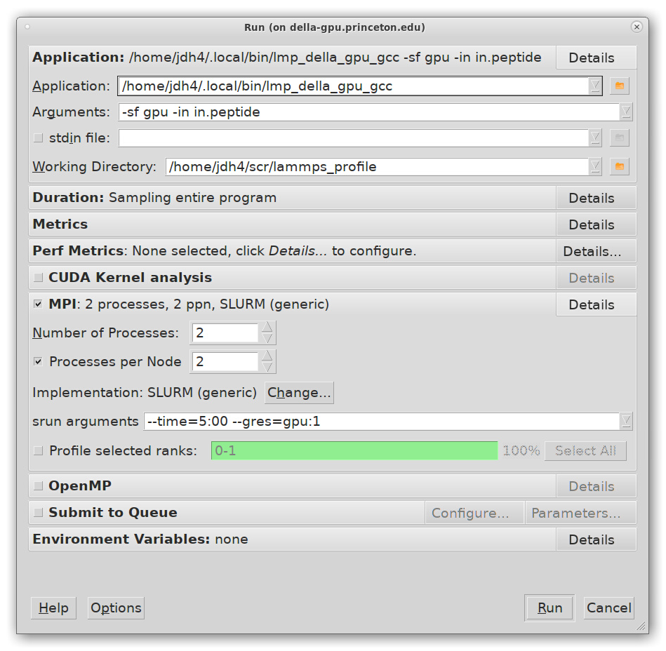
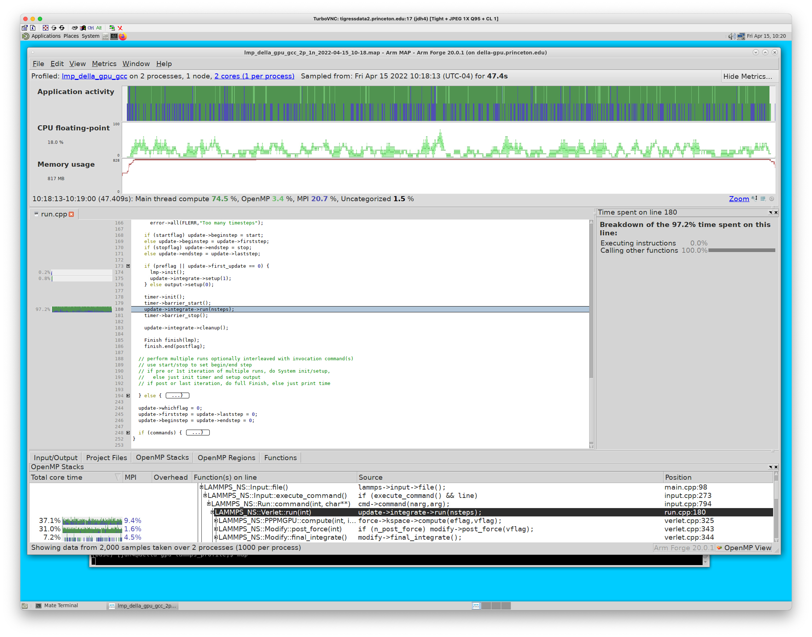
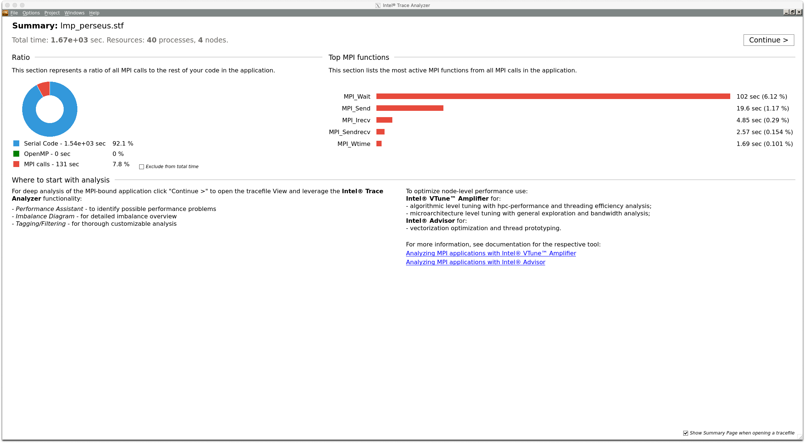
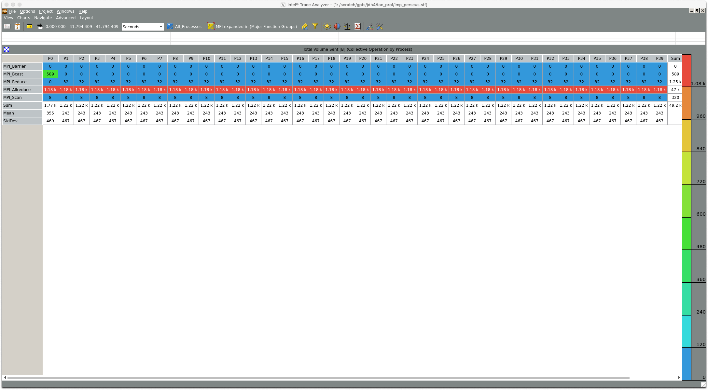

# Profiling LAMMPS on the HPC Clusters

LAMMPS does a far better job than most applications at providing the user with performance information.
After running the simple Lennard-Jones melt example one is presented with the following
output:

```
Section |  min time  |  avg time  |  max time  |%varavg| %total
---------------------------------------------------------------
Pair    | 30.142     | 31.153     | 31.467     |   5.9 | 66.86
Neigh   | 3.9385     | 4.1186     | 4.2871     |   4.7 |  8.84
Comm    | 7.4789     | 7.8568     | 9.1557     |  15.3 | 16.86
Output  | 0.0024502  | 0.0028641  | 0.0035353  |   0.6 |  0.01
Modify  | 3.1699     | 3.2907     | 3.481      |   2.9 |  7.06
Other   |            | 0.1741     |            |       |  0.37
```

While the LAMMPS output provides a nice overview, it does not give detailed information.
It is important to profile a code that you are trying to make faster so that you know
which part of the code to work on.
Profiling reveals the hotspots or parts of the code that are the most time-consuming.
These are the areas that developers should focus on since that is where the biggest
gains in performance can be won.

If you are modifying the LAMMPS source code then you may be interested in monitoring the
performance of the resulting code. This can be done using a profiling tool such as Arm MAP.

## Profiling with Arm MAP

The general directions for using MAP on the HPC clusters are [here](https://researchcomputing.princeton.edu/support/knowledge-base/map).

Below are directions specific to LAMMPS:

1. Connect to a cluster (e.g., della-gpu) with [X11 forwarding](https://researchcomputing.princeton.edu/support/knowledge-base/gui-applications) enabled: `ssh -X <YourNetID>@della-gpu.princeton.edu`

2. Follow the [build from source](https://github.com/PrincetonUniversity/install_lammps/blob/master/01_installing/ins/della/scripts.md#della-gpu) directions with this modification to the script:

```
-D CMAKE_CXX_FLAGS_RELEASE="-O3 -g" \
```

3. Load the appropriate modules:

```
$ module load anaconda3/2021.11  # map looks for python (not python3)
$ module load openmpi/gcc/4.1.2
$ module load cudatoolkit/11.6
$ module load fftw/gcc/3.3.9
$ module load map/20.0.1
```

You may need to create the wrapper script:

```
$ export MPICC=`which mpicc`
$ /usr/licensed/ddt/ddt20.0.1/rhel7/x86_64/map/wrapper/build_wrapper
```

4. Launch the MAP profiler:

```
$ map
```

5. Click on "Profile" in the main menu and then input the settings shown below:

<p align="center">

</p>

Be sure to set the template file to `slurm-default.qtf` as shown below:

<p align="center">

</p>

6. Click "Run" to submit the job to the queue. After it runs you will be presented with your profiling data interactively in MAP. Note that the profiling data will also be written to a file which you can load at a later time without needing to re-run the job. The file is stored in the gzip compressed data format with a name like lmp_della_gpu_gcc_2p_1n_2022-04-15_10-18.map.

Allinea MAP can be used to investigate the performance of the code with respect to CPU usage, threading behavior, I/O, memory and MPI communication. One can identify the hotspots in the code which could be improved on by a developer.

The figure below show some of the information that MAP provides. Click on the image to make it larger.

<p align="center">

</p>

The directions above are for interactive use. One can also submit via Slurm:

```
#!/bin/bash
#SBATCH --nodes=1
#SBATCH --ntasks=2
#SBATCH --cpus-per-task=1
#SBATCH --time=00:05:00
#SBATCH --mem-per-cpu=4G
#SBATCH --gres=gpu:1

module purge
module load anaconda3/2021.11
module load fftw/gcc/3.3.9
module load openmpi/gcc/4.1.2
module load cudatoolkit/11.6
module load map/20.0.1

export OMP_NUM_THREADS=$SLURM_CPUS_PER_TASK
export MPICC=`which mpicc`
export ALLINEA_MPI_WRAPPER=$HOME/.allinea/wrapper/libmap-sampler-pmpi-della-gpu.princeton.edu.so
export ALLINEA_DEBUG_SRUN_ARGS="%default% --oversubscribe"

map --profile srun $HOME/.local/bin/lmp_della_gpu_gcc -sf gpu -in in.peptide
```

Note the line:

```
export ALLINEA_DEBUG_SRUN_ARGS="%default% --oversubscribe"
```

Without the above line one will encounter:

```
Arm Forge 20.0.1 - Arm MAP

MAP: This version of Arm MAP is over a year old.
MAP: Arm only provide support for the most recent version of Arm MAP.
MAP: Please consider upgrading.
srun: error: Unable to create step for job 40315609: Requested nodes are busy
MAP: Arm MAP could not launch the debuggers:
MAP: srun exited with code 1
```

## Profiling with the Intel Trace Analyzer and Collector

The general directions for using ITAC are [here](https://researchcomputing.princeton.edu/faq/using-intel-trace-analyze).

Makefile.perseus

module load intel-tac intel intel-mpi
`make perseus` from lammps/src

```
SHELL = /bin/sh

# ---------------------------------------------------------------------
# compiler/linker settings
# specify flags and libraries needed for your compiler

CC =		mpicxx
CCFLAGS =	-Ofast -xHost -mtune=broadwell -g -trace
SHFLAGS =	-fPIC
DEPFLAGS =	-M

LINK =		mpicxx
LINKFLAGS =	-Ofast -xHost -mtune=broadwell -g -trace
LIB = 
SIZE =		size
```


```
module load intel-tac intel intel-mpi
cmake3 -D CMAKE_INSTALL_PREFIX=$HOME/.local -D LAMMPS_MACHINE=perseus_profiling -D ENABLE_TESTING=yes -D BUILD_MPI=yes -D BUILD_OMP=yes -D CMAKE_C_COMPILER=icc -D CMAKE_CXX_COMPILER=icpc -D CMAKE_CXX_FLAGS_RELEASE="-Ofast -xHost -mtune=broadwell -g -trace" -D PKG_USER-OMP=yes ../cmake
```

Run the code with the following Slurm script:

```
#!/bin/bash
#SBATCH --nodes=4
#SBATCH --ntasks-per-node=10
#SBATCH --cpus-per-task=1
#SBATCH --time=00:01:00
#SBATCH --mem-per-cpu=1G

export VT_PCTRACE=1
export VT_TIMER=CPU

module load intel-tac intel intel-mpi
export OMP_NUM_THREADS=$SLURM_CPUS_PER_TASK

cd /scratch/gpfs/jdh4/itac_prof

srun $HOME/sw/lammps-5Jun19/src/lmp_perseus -in $HOME/makefile_tac/in.melt
```

Because the Intel Trace Analyzer and Collector stores a lot of data, we store everything
on the local disk of the node and then copy it to our /scratch/gpfs directory before
the job ends.

`traceanalyzer /scratch/gpfs/jdh4/itac_prof/lmp_perseus.stf`

<p align="center">

</p>

<p align="center">

</p>

Watch the last one-third of this YouTube [video](https://www.youtube.com/watch?v=lQcTxVygROw) to learn more about ITAC.
