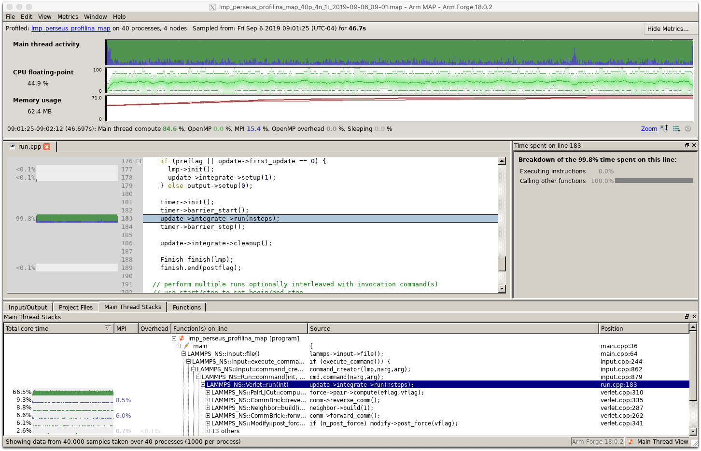
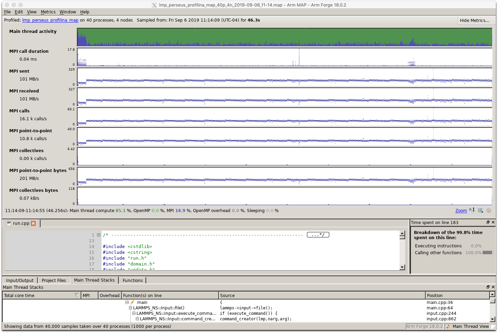
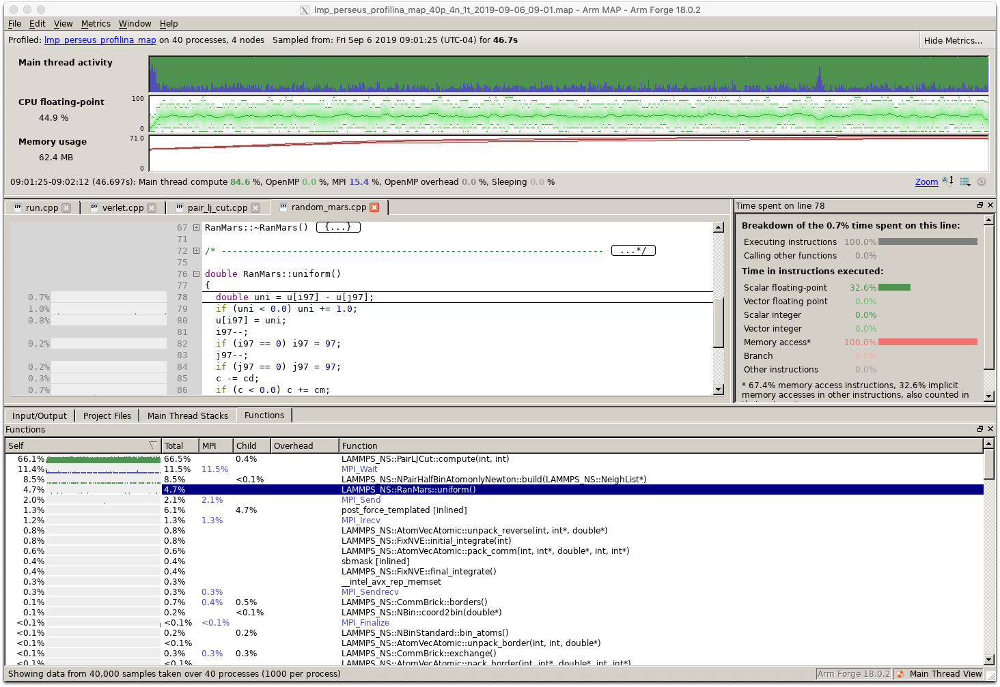

# Profiling LAMMPS on the HPC Clusters

LAMMPS does a far better job than most at providing the user with performance information.
After running the simple Lennard-Jones melt example one is presented with the following
output:

```
Section |  min time  |  avg time  |  max time  |%varavg| %total
---------------------------------------------------------------
Pair    | 30.142     | 31.153     | 31.467     |   5.9 | 66.86
Neigh   | 3.9385     | 4.1186     | 4.2871     |   4.7 |  8.84
Comm    | 7.4789     | 7.8568     | 9.1557     |  15.3 | 16.86
Output  | 0.0024502  | 0.0028641  | 0.0035353  |   0.6 |  0.01
Modify  | 3.1699     | 3.2907     | 3.481      |   2.9 |  7.06
Other   |            | 0.1741     |            |       |  0.37
```

While the LAMMPS output provides a nice overview, it does not give detailed information.
It is important to profile a code that you are trying to make faster so that you know
which part of the code to work on.
Profiling reveals the hotspots or parts of the code that are the most time-consuming.
These are the areas that developers should focus on since that is where the biggest
gains in performance can be won.

If you are modifying the LAMMPS source code then you may be interested in monitoring the
performance of the resulting code. This can be done using a profiling tool such as the
Intel Advisor.

## Profiling with Allinea MAP

The general directions for using MAP on the HPC clusters are [here](https://researchcomputing.princeton.edu/faq/profiling-with-allinea-ma).

Below are directions specific to LAMMPS:

1. Connect to a cluster (e.g., perseus) with X11 forwarding enabled: `ssh -X <NetID>@perseus.princeton.edu`

2. Build the application with optimization and debugging flags:

```
cmake3 -D CMAKE_INSTALL_PREFIX=$HOME/.local -D LAMMPS_MACHINE=perseus_profilina_map -D ENABLE_TESTING=yes -D BUILD_MPI=yes -D BUILD_OMP=yes -D CMAKE_C_COMPILER=icc -D CMAKE_CXX_COMPILER=icpc -D CMAKE_CXX_FLAGS_RELEASE="-O3 -g" -D PKG_USER-OMP=yes ../cmake
```

Note that there are more optimal ways to build the code than the line above. See the installation directory.

3. Load the appropriate modules and set the MPICC environment variable:

```
module load intel intel-mpi
export MPICC=`which mpicc`
```

4. Launch the MAP profiler: `/usr/licensed/bin/map`

5. Click on "Profile" in the main menu and then input the settings shown below:

<p align="center">

</p>

Be sure to set the template file to `slurm-default.qtf` as shown below:

<p align="center">

</p>

6. Click "Submit" to submit the job to the queue. After it runs you will be presented with your profiling data in MAP. Note that the profiling data will also be written to a file which you can load at a later time without needing to re-run the job. The file is stored in the gzip compressed data format with a name like lmp_perseus_profilina_map_40p_4n_1t_2019-09-06_09-01.map.

Here is the output of the code:

```
Submitted batch job 342383
LAMMPS (5 Jun 2019)
  using 1 OpenMP thread(s) per MPI task
Lattice spacing in x,y,z = 1.6796 1.6796 1.6796
Created orthogonal box = (0 0 0) to (50.3879 50.3879 50.3879)
  4 by 2 by 5 MPI processor grid
Created 108000 atoms
  create_atoms CPU = 0.00245619 secs
Neighbor list info ...
  update every 20 steps, delay 0 steps, check no
  max neighbors/atom: 2000, page size: 100000
  master list distance cutoff = 2.8
  ghost atom cutoff = 2.8
  binsize = 1.4, bins = 36 36 36
  1 neighbor lists, perpetual/occasional/extra = 1 0 0
  (1) pair lj/cut, perpetual
      attributes: half, newton on
      pair build: half/bin/atomonly/newton
      stencil: half/bin/3d/newton
      bin: standard
Setting up Verlet run ...
  Unit style    : lj
  Current step  : 0
  Time step     : 0.005
Per MPI rank memory allocation (min/avg/max) = 3.229 | 3.229 | 3.23 Mbytes
Step Temp E_pair E_mol TotEng Press 
       0            1   -6.7733681            0   -5.2733819   -5.3911251 
    2000    1.0038937   -5.3375668            0   -3.8317401    2.5870331 
    4000   0.99585577   -5.3378618            0    -3.844092    2.5863738 
    6000   0.99511411   -5.3403821            0   -3.8477247    2.5760252 
    8000   0.99503755   -5.3438572            0   -3.8513147    2.5573951 
   10000   0.99995609   -5.3399769            0   -3.8400566    2.5758548 
   12000   0.99990993   -5.3424671            0   -3.8426161     2.566553 
   14000    1.0004727   -5.3418776            0   -3.8411825    2.5683336 
   16000   0.99982864   -5.3421343            0   -3.8424052     2.564338 
   18000    1.0022825   -5.3366585            0   -3.8332487    2.5914067 
   20000    1.0059315   -5.3382833            0      -3.8294     2.589934 
Loop time of 46.5962 on 40 procs for 20000 steps with 108000 atoms
Performance: 185422.844 tau/day, 429.220 timesteps/s
97.4% CPU use with 40 MPI tasks x 1 OpenMP threads
MPI task timing breakdown:
Section |  min time  |  avg time  |  max time  |%varavg| %total
---------------------------------------------------------------
Pair    | 30.142     | 31.153     | 31.467     |   5.9 | 66.86
Neigh   | 3.9385     | 4.1186     | 4.2871     |   4.7 |  8.84
Comm    | 7.4789     | 7.8568     | 9.1557     |  15.3 | 16.86
Output  | 0.0024502  | 0.0028641  | 0.0035353  |   0.6 |  0.01
Modify  | 3.1699     | 3.2907     | 3.481      |   2.9 |  7.06
Other   |            | 0.1741     |            |       |  0.37
Nlocal:    2700 ave 2731 max 2665 min
Histogram: 1 2 4 5 6 6 7 4 3 2
Nghost:    4719.8 ave 4769 max 4689 min
Histogram: 5 6 3 8 5 4 6 2 0 1
Neighs:    101770 ave 104066 max 100013 min
Histogram: 3 4 3 9 5 7 5 2 0 2
Total # of neighbors = 4070785
Ave neighs/atom = 37.6925
Neighbor list builds = 1000
Dangerous builds not checked
Total wall time: 0:00:46
```

Note that that LAMMPS provides its own profiling information. The pair, neigh and comm sections dominate the calculation. There is excellent agreement between the LAMMPS profiling data and that obtained with MAP. MAP provides much more data and the ability to investigate performance in great details down to individual lines in the source code.

Allinea MAP can be used to investigate the performance of the code with respect to CPU usage, threading behavior, I/O, memory and MPI communication. One can identify the hotspots in the code which could be improved on by a developer. Because LAMMPS is well written the profiling data is mostly uninteresting. However, if you modify the source code this may change.

The three figures below show some of the information that MAP provides. Click on an image to make it larger.

<p align="center">

</p>

<p align="center">

</p>

<p align="center">

</p>

## Profiling with the Intel Trace Analyzer and Collector

The general directions for using ITAC are [here](https://researchcomputing.princeton.edu/faq/using-intel-trace-analyze).

Makefile.perseus

module load intel-tac intel intel-mpi
`make perseus` from lammps/src

```
SHELL = /bin/sh

# ---------------------------------------------------------------------
# compiler/linker settings
# specify flags and libraries needed for your compiler

CC =		mpicxx
CCFLAGS =	-Ofast -xHost -mtune=broadwell -g -trace
SHFLAGS =	-fPIC
DEPFLAGS =	-M

LINK =		mpicxx
LINKFLAGS =	-Ofast -xHost -mtune=broadwell -g -trace
LIB = 
SIZE =		size
```


```
module load intel-tac intel intel-mpi
cmake3 -D CMAKE_INSTALL_PREFIX=$HOME/.local -D LAMMPS_MACHINE=perseus_profiling -D ENABLE_TESTING=yes -D BUILD_MPI=yes -D BUILD_OMP=yes -D CMAKE_C_COMPILER=icc -D CMAKE_CXX_COMPILER=icpc -D CMAKE_CXX_FLAGS_RELEASE="-Ofast -xHost -mtune=broadwell -g -trace" -D PKG_USER-OMP=yes ../cmake
```

Run the code with the following Slurm script:

```
#!/bin/bash
#SBATCH --nodes=4
#SBATCH --ntasks-per-node=10
#SBATCH --cpus-per-task=1
#SBATCH --time=00:01:00
#SBATCH --mem-per-cpu=1G

export VT_PCTRACE=1
export VT_TIMER=CPU

module load intel-tac intel intel-mpi
export OMP_NUM_THREADS=$SLURM_CPUS_PER_TASK

cd /scratch/gpfs/jdh4/itac_prof

srun $HOME/sw/lammps-5Jun19/src/lmp_perseus -in $HOME/makefile_tac/in.melt
```

Because the Intel Trace Analyzer and Collector stores a lot of data, we store everything
on the local disk of the node and then copy it to our /scratch/gpfs directory before
the job ends.

`traceanalyzer /scratch/gpfs/jdh4/itac_prof/lmp_perseus.stf`

<p align="center">

</p>

<p align="center">

</p>

Watch the last one-third of this YouTube [video](https://www.youtube.com/watch?v=lQcTxVygROw) to learn more about ITAC.
